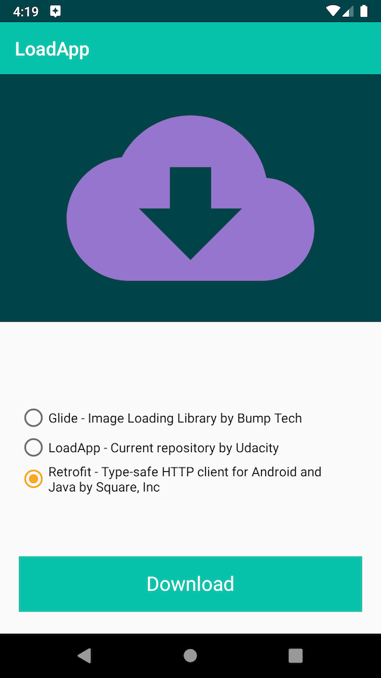
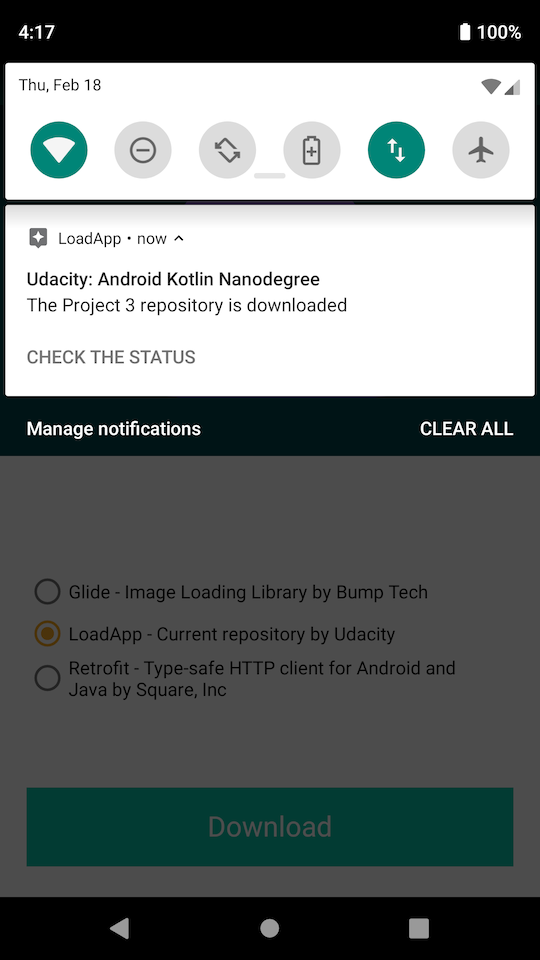
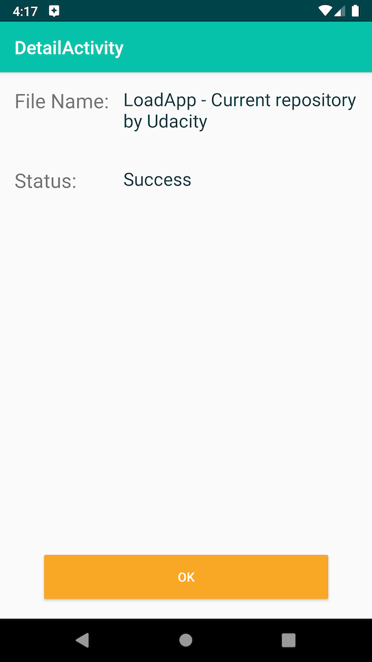

# Load app

This is an application that downloads a file from the Internet by clicking on a custom-built button.

Once the download is complete, a notification is sent. When a user clicks on the notification, detail activity is opened.

Detail activity is animated via MotionLayout upon opening.

 

